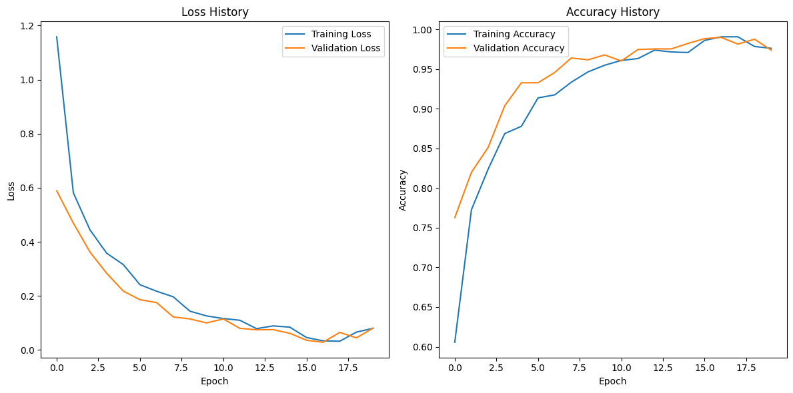

# Brain Tumor Detection with a Custom CNN — 97.41% Accuracy without Transfer Learning


---

## 🔍 Project Overview  
This project classifies MRI brain scans into four tumor categories using a **custom-built Convolutional Neural Network (CNN)**.  
Unlike most implementations that rely on pretrained networks such as ResNet or EfficientNet, this model was built **entirely from scratch**, demonstrating that a lightweight architecture can still achieve **97.41% validation accuracy** on a real-world medical dataset.

---

## 🎯 Motivation  
The objective of this project was to develop a deep-learning solution from the ground up — rather than relying on pre-trained weights — in order to gain a comprehensive understanding of convolutional neural networks. The focus was on building, training, debugging, and optimizing every component manually.

---

## 🧠 Dataset  
- **Source:** Brain Tumor MRI Dataset (Kaggle).  
- **Classes (4):**  
  - Glioma Tumor  
  - Meningioma Tumor  
  - Pituitary Tumor  
  - No Tumor  
- **Folder structure required:**

data/
├── Training/
│ ├── glioma
│ ├── meningioma
│ ├── pituitary
│ └── no_tumor
└── Testing/
├── glioma
├── meningioma
├── pituitary
└── no_tumor

yaml
Copy code

---

## 🏗️ Model Architecture

| Layer | Operation | Output Shape |
|--------|----------|--------------|
| 1      | Conv2d(3 → 16, 3×3) + ReLU         | 224×224×16 |
| 2      | MaxPool2d(2×2)                      | 112×112×16 |
| 3      | Conv2d(16 → 32, 3×3) + ReLU        | 112×112×32 |
| 4      | MaxPool2d(2×2)                      | 56×56×32  |
| 5      | Flatten                             | 56×56×32 → 100,352 |
| 6      | Linear(100,352 → 128) + ReLU       | 128       |
| 7      | Linear(128 → 4)                    | 4 logits  |

✅ No pretrained model  
✅ Only **2 convolutional layers**  
✅ ~3.2 million parameters (approx.)  

---

## ⚙️ Training Configuration

- Optimizer: Adam  
- Learning rate: 0.001  
- Loss function: CrossEntropyLoss  
- Epochs: 20  
- Batch size: 16  
- Framework: PyTorch  

---

## 📈 Results

- **Validation Accuracy:** **97.41%**  
- Loss convergence: stable decline, no major divergence  
- Visual training curves :

  


---

## 📥 Download Trained Model  
Download the trained model weights here:  
[Download best_model.pth](https://drive.google.com/file/d/1Qz-sfO9MEvaOHMJSRPZcEry4aA7q34hT/view?usp=sharing)

You can use the following inference snippet:

```python
!pip install gdown
import gdown
gdown.download('https://drive.google.com/uc?id=1Qz-sfO9MEvaOHMJSRPZcEry4aA7q34hT', 'best_model.pth', quiet=False)

from model import TumorClassifier
import torch

model = TumorClassifier(num_classes=4)
model.load_state_dict(torch.load("best_model.pth", map_location='cpu'))
model.eval()
```
#🔮 **Future Work**

 -Integrate Grad-CAM visualization for explainability of model predictions.
 -Compare performance against a pretrained network (e.g., ResNet-18) to demonstrate the trade-off between lightweight vs heavy models.
 -Implement test-time augmentation and confidence scoring for better clinical robustness.
 -Package and deploy the model via FastAPI or Streamlit for interactive use.
 -Convert model to ONNX/TorchScript for mobile or edge deployment.

#🧪 Key Skills Demonstrated
✅ Designed and implemented a CNN from scratch (no transfer learning)
✅ Created a full data-loading and augmentation pipeline tailored for MRI images
✅ Managed training cycles, tracking of loss/accuracy, and handled model checkpointing
✅ Prepared reproducible code, saved model weights, and documented the complete process
✅ Learned how to overcome dataset challenges, debugging network convergence, and presenting results for production readiness

👤 Author
Developed by AJAY KUMAR

